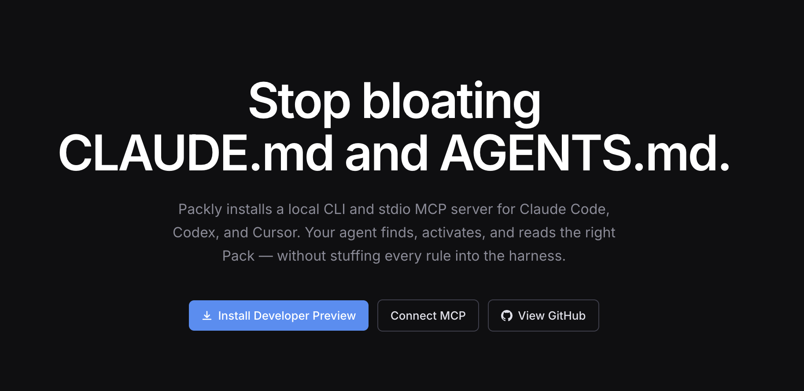
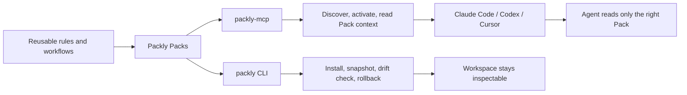

<p align="center">
  
</p>

<p align="center">
  <a href="https://github.com/Orvek-dev/packly-developer-preview/releases/tag/v0.59.1"></a>
  <a href="./LICENSE"></a>
  
  
  
  
  
</p>

# Packly Developer Preview

Packly installs a local CLI and stdio MCP server for Claude Code, Codex, and Cursor. Your agent finds, activates, and reads the right Pack only when needed, instead of stuffing every rule, role, skill, and workflow into one always-loaded `CLAUDE.md` or `AGENTS.md`.

This repository is the public distribution and feedback channel. The product source repository remains private during the Developer Preview.

## Overview

| Surface | What it does | Why it helps |
| --- | --- | --- |
| Pack | Reusable instructions, workflows, and framework files. | Keeps agent context modular instead of pasted into every project. |
| `packly` | Local CLI for install/update/disable/rollback, readiness checks, snapshots, and drift checks. | File changes stay explicit, inspectable, and reversible. |
| `packly-mcp` | Local stdio MCP server for Claude Code, Codex, and Cursor. | Agents discover and read the right Pack context at task time. |
| Sample Packs | `small-pr-planner`, `review-loop`, and `security-guardrails`. | Gives you working examples without exposing the private product source. |
| Preview channel | Public docs, release artifacts, sample Packs, and feedback. | Lets users test the workflow before the stable product ships. |

## Why Packly?

AI coding workspaces are starting to accumulate long `CLAUDE.md` / `AGENTS.md` files, copied rules, duplicated roles, generated framework files, and unclear rollback paths. Packly moves that material into Packs, then lets the agent retrieve only the Pack context that matches the current task.

## How It Works



## Docs

| Document | Use it for |
| --- | --- |
| [Quickstart](docs/quickstart.md) | Install Packly, connect MCP, and import a sample Pack. |
| [Safety](docs/safety.md) | Understand what MCP can read, plan, and request. |
| [Integrity](docs/integrity.md) | Verify release-pinned installer and archive checksums. |
| [Feedback](docs/feedback.md) | Report install, MCP, and Pack routing issues safely. |

## Quickstart

Homebrew is recommended on macOS Apple Silicon and Linux x64:

```sh
brew tap Orvek-dev/packly
brew install packly
packly --version
packly mcp status --mcp-bin packly-mcp
packly mcp readiness --no-workspace --mcp-bin packly-mcp
```

Then connect Packly MCP to Claude Code, Codex, or Cursor:

```sh
packly mcp config --client all --mcp-bin packly-mcp
```

## What You Install

- `packly`: local CLI for Pack install/update/disable/rollback, readiness checks, and Pack store management.
- `packly-mcp`: local stdio MCP server launched by Claude Code, Codex, or Cursor.

Packly MCP runs on your machine through stdin/stdout. It is not a hosted server.

```text
Claude / Codex / Cursor
  -> starts local packly-mcp command
  -> talks over stdio MCP
  -> reads Packly local store and workspace metadata
```

## Current Release

- Version: `v0.59.1`
- Status: Developer Preview / prerelease
- Website: https://usepackly.com
- Binary artifacts:
  - macOS Apple Silicon (`aarch64-apple-darwin`)
  - Linux x64 (`x86_64-unknown-linux-gnu`)
  - Windows x64 (`x86_64-pc-windows-msvc`)
- Source code: not published in this distribution repository
- License: Packly Developer Preview License

## Other Install Paths

Direct Homebrew formula install:

```sh
brew install Orvek-dev/packly/packly
```

Release-pinned install script for macOS Apple Silicon or Linux x64:

```sh
curl -fsSL https://github.com/Orvek-dev/packly-developer-preview/releases/download/v0.59.1/install.sh
```

Install:

```sh
curl -fsSL https://github.com/Orvek-dev/packly-developer-preview/releases/download/v0.59.1/install.sh | sh
```

Optional installer script verification:

```sh
curl -fsSLO https://github.com/Orvek-dev/packly-developer-preview/releases/download/v0.59.1/install.sh
printf '%s  %s\n' 'e82cdfa51febebcc38fa8c97631751c22c64265d7c1b0ada4996cf1b3709d032' 'install.sh' | shasum -a 256 -c -
sh install.sh
```

Add Packly to your shell if the installer asks:

```sh
export PATH="$HOME/.packly/bin:$PATH"
```

Windows x64 users can download the zip from the [v0.59.1 release](https://github.com/Orvek-dev/packly-developer-preview/releases/tag/v0.59.1), verify it against `checksums.txt`, and add the extracted directory to `PATH`. The shell installer also supports Git Bash/MSYS/Cygwin environments.

The release-pinned installer verifies a pinned SHA-256 digest for the default
`v0.59.1` `checksums.txt` before verifying the selected archive. See
[docs/integrity.md](docs/integrity.md).

Verify:

```sh
packly --version
packly mcp status --mcp-bin "$HOME/.packly/bin/packly-mcp"
packly mcp readiness --no-workspace --mcp-bin "$HOME/.packly/bin/packly-mcp"
```

## Connect MCP

Generate client setup snippets:

```sh
packly mcp config --client all --mcp-bin "$HOME/.packly/bin/packly-mcp"
```

Claude Code:

```sh
claude mcp add --transport stdio --scope user packly -- "$HOME/.packly/bin/packly-mcp" --session default
claude mcp list
```

Codex:

```sh
packly mcp install-client --client codex --mcp-bin "$HOME/.packly/bin/packly-mcp" --dry-run
packly mcp install-client --client codex --mcp-bin "$HOME/.packly/bin/packly-mcp"
```

Cursor:

```sh
packly mcp install-client --client cursor --mcp-bin "$HOME/.packly/bin/packly-mcp" --dry-run
packly mcp install-client --client cursor --mcp-bin "$HOME/.packly/bin/packly-mcp"
```

## Try A Sample Pack

Import a sample Pack, then ask your MCP client to route a real coding task through it:

```sh
packly pack import-url https://github.com/Orvek-dev/packly-developer-preview/tree/main/packs/small-pr-planner
packly pack list
```

Then ask your MCP client to use Packly for a task such as:

```text
Use Packly to plan this change as small PRs.
```

Sample Packs:

- `small-pr-planner`: split a large task into reviewable PR-sized chunks.
- `review-loop`: run a test/review/fix loop before completion.
- `security-guardrails`: check secrets, risky commands, dependency and release risks.

## MCP Tools

The preview MCP server currently exposes:

```text
packly_find_packs
packly_diagnose_agent_surface
packly_lint_agent_surface
packly_plan_agent_surface_sync
packly_get_context_budget
packly_get_session_usage_budget
packly_explain_context_routing
packly_start_task
packly_session_summary
packly_prepare_cloud_sync
packly_get_pack_brief
packly_activate_pack
packly_read_pack_context
packly_get_workspace_status
packly_plan_pack_install
packly_plan_pack_update
packly_request_pack_install
packly_request_pack_update
packly_list_approval_requests
packly_get_approval_request
packly_list_active_packs
packly_clear_active_packs
packly_list_session_history
```

## Safety Model

Packly MCP is designed as a context router and planning surface.

- MCP can read Pack context that you imported into the local Packly store.
- MCP install/update tools return plans or approval requests.
- MCP does not directly apply Pack files to your workspace.
- CLI apply commands own file mutation, snapshot, rollback, and drift checks.
- Client config install for Codex/Cursor supports `--dry-run` and creates backups before writes.

See [docs/safety.md](docs/safety.md).

## Integrity And License

Only `v0.59.1` is supported for this public Developer Preview. Older prerelease
artifacts should not be used.

The Packly CLI/MCP binaries are distributed under the
[Packly Developer Preview License](LICENSE). The source code remains private.

This preview does not yet include detached signatures, Sigstore attestations,
SBOMs, macOS Developer ID notarization, or Windows code signing. Homebrew pins
release asset SHA-256 values, and the shell installer pins the release checksum
manifest digest for the default release.

## Feedback

The Developer Preview is looking for concrete workflow feedback:

- Did install complete?
- Did `packly mcp status` pass?
- Did your client see Packly MCP tools?
- Where did Pack discovery, activation, or context reading feel unclear?
- Did you still need to paste `CLAUDE.md`, `AGENTS.md`, skills, or rules manually?

Do not paste source code, secret values, `.env` files, private Pack contents, or raw AI conversations into issues.

For install failures, open an issue with:

```sh
packly --version
packly doctor --no-workspace --mcp-bin "$HOME/.packly/bin/packly-mcp" --bundle
packly mcp status --mcp-bin "$HOME/.packly/bin/packly-mcp"
packly mcp readiness --no-workspace --mcp-bin "$HOME/.packly/bin/packly-mcp"
```

Review the generated doctor bundle before posting. Packly redacts common local paths and omits source code, Pack bodies, secret values, and raw conversations by design, but public issues should still be checked manually.

See [docs/feedback.md](docs/feedback.md).

## Known Limitations

- Developer Preview is not the stable Packly product.
- Public source is not included in this distribution repository.
- macOS Intel and Linux ARM64 binaries are not published yet.
